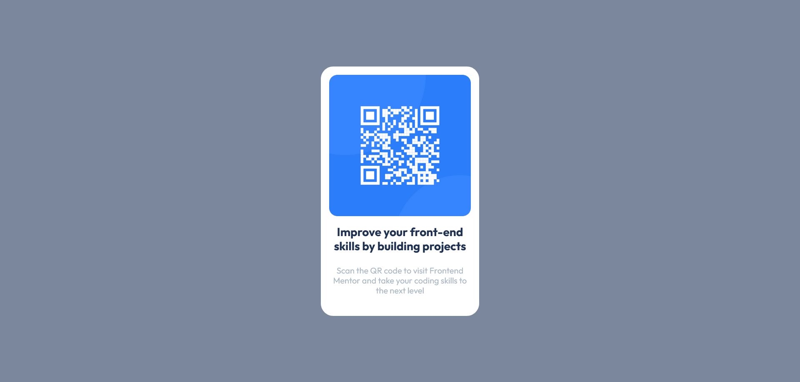

# Frontend Mentor - QR Code Component Solution

This is a solution to the [QR code component challenge on Frontend Mentor](https://www.frontendmentor.io/challenges/qr-code-component-iux_sIO_H).

## Table of contents

- [Overview](#overview)
  - [Screenshot](#screenshot)
  - [Links](#links)
- [My process](#my-process)
  - [Built with](#built-with)
  - [What I learned](#what-i-learned)
  - [Continued development](#continued-development)

## Overview

### Screenshot



### Links

- Solution URL: [Add solution URL here](https://your-solution-url.com)
- Live Site URL: [Add live site URL here](https://your-live-site-url.com)

## My process

### Built with

- Semantic HTML5 Markup
- CSS Custom Properties
- Flexbox

### What I learned

I learnt how to center the card in the viewport using the "vh" unit that I had not learnt about before. I also learnt how to resize the image (QR Code) using the max-width property.

```css
.card-container img {
    max-width: 100%;
    padding: 20px;
    border-radius: 40px;
}
```

### Continued development

I still seem to struggle with resizing and positioning images. This is something I'd like to continue working on. I also need to continue practicing using Flexbox.